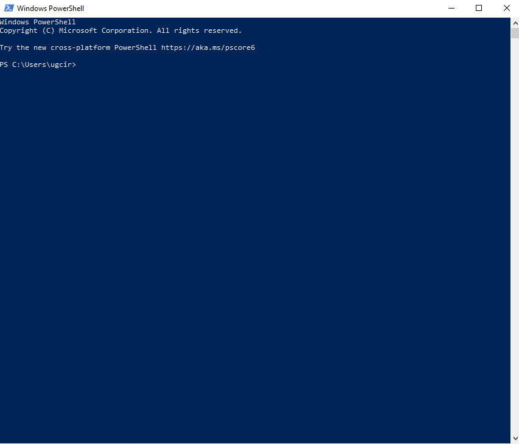
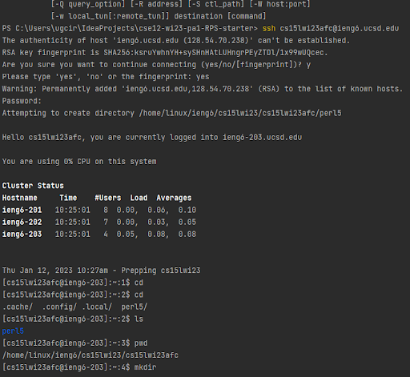
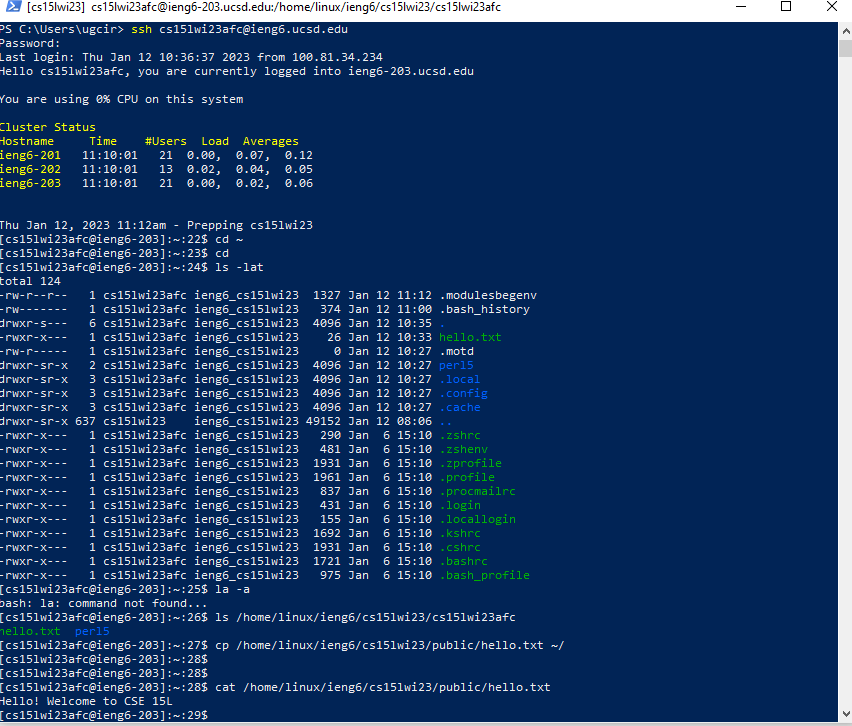

Step one
=========
I skipped downloading vscode because I already had another code editor. I also did not use my code editor because Windows Powershell uses less resources than the ide to use.
	
For those not on Windows, use VSCode to open a terminal. 

Step two
=========
I then logged in to the remote server by using the ssh command. Since it was the first time logging in, I had to confirm that I wanted to continue by typing `yes`

Step three
=========
I tried all the commands that were suggested on the remote server. The `cat` command printed the contents of hello.txt which were "Hello! Welcome to CSE 15L". Finally, I exited by typing `exit` in the command line. Another option would have been to use Ctrl-D.

