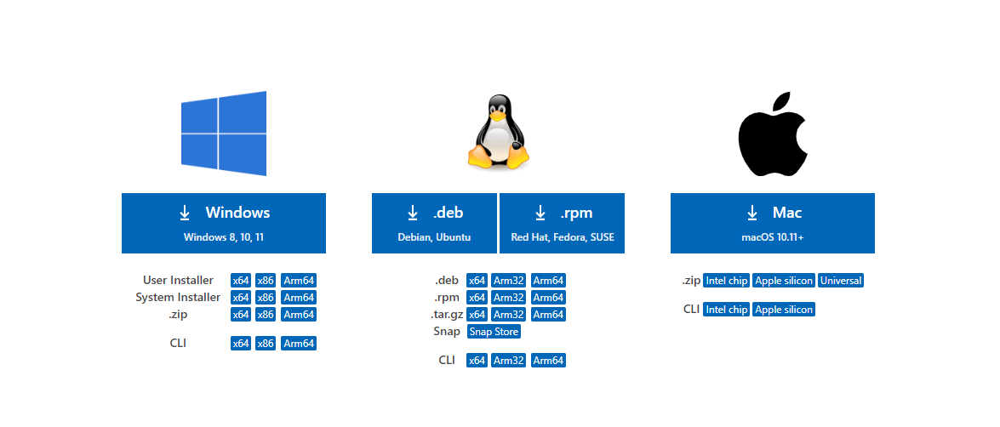
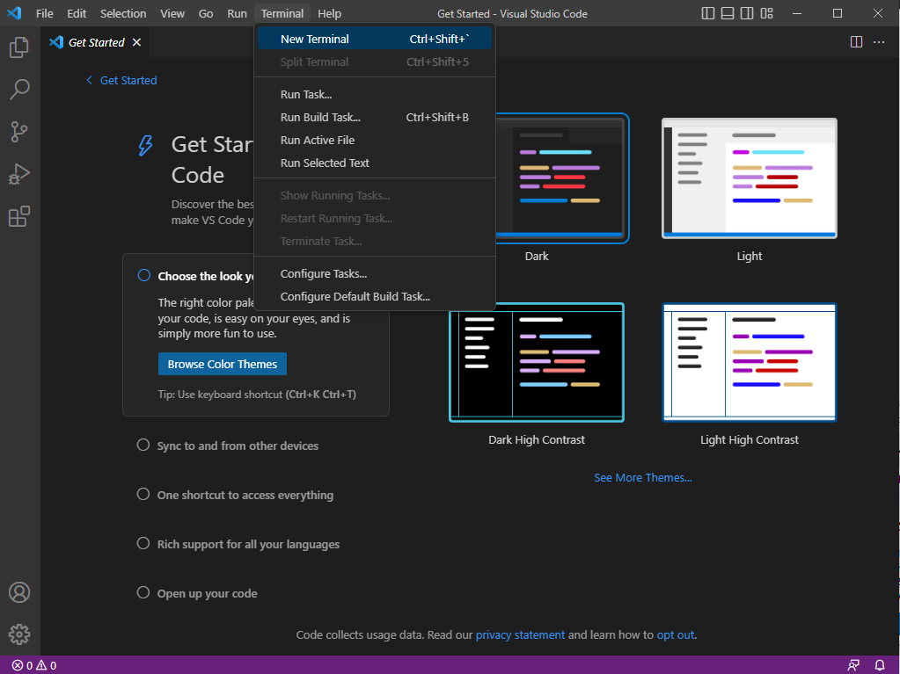

Step one
=========
I skipped downloading vscode because I already had another code editor. I also did not use my code editor because Windows Powershell uses less resources than the ide to use.
	
For those not on Windows, use VSCode to open a terminal. Then, select your 
OS and download

Use default settings to install vscode, and on opening find ```Terminal``` and 
open a new terminal


Step two
=========
I then logged in to the remote server by using the ssh command. Since it was 
the first time logging in, I had to confirm that I wanted to continue by 
typing ```yes```\
Specifically:\
```$ ssh cs15lwi23zz@ieng6.ucsd.edu``` - connects to the server and prompts the 
user if they want to continue\
```yes``` - confirms that the user wants to continue prompts for password


Step three
=========
I tried all the commands that were suggested on the remote server. The `cat` 
command printed the contents of hello.txt which were "Hello! Welcome to CSE 15L". Finally, I exited by typing `exit` in the command line. Another option would have been to use Ctrl-D.\
```cd ~``` - sets directory to current directory\
```cd``` - does not change directory\
```ls -lat``` - lists all files in directory in new lines\
```ls -a``` - lists all files in directory with tabs in between\
```/home/linux/ieng6/cs15lwi23/cs15lwi23afc``` - lists files in home directory\
```cat /home/linux/ieng6/cs15lwi23/public/hello.txt``` - prints out contents 
of hello.txt: "Hello! Welcome to CSE 15L"

