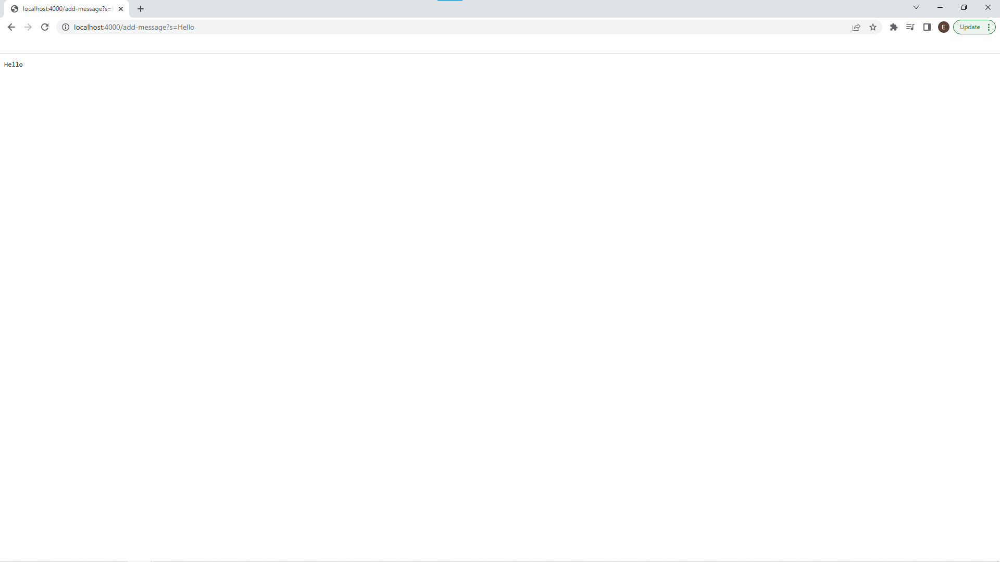
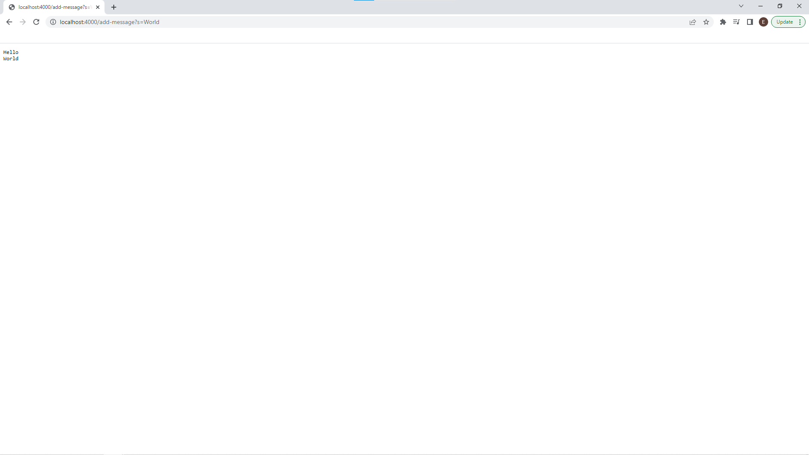
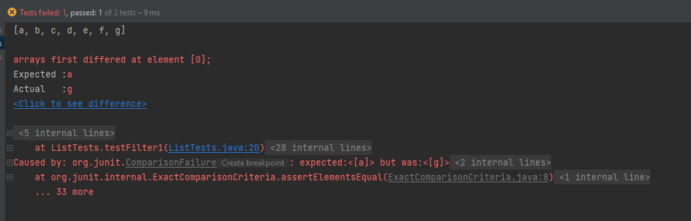
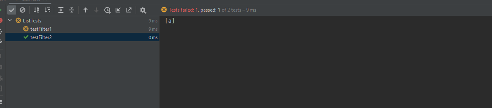

Part 1
=========
Code:
```
import java.io.IOException;
import java.net.URI;
import java.util.ArrayList;

class StringServerHandler implements URLHandler {
    ArrayList<String> str = new ArrayList<>();
    public String handleRequest(URI url) {
        if (url.getPath().equals("/")) {
            String out = "";
            for (String s : str) {
                out += s + "\n";
            }
            return out;
        } else if (url.getPath().contains("/add-message")) {
            String[] parameters = url.getQuery().split("=");
            if (parameters[0].equals("s")) {
                str.add(parameters[1]);
                String out = "";
                for (String s : str) {
                    out += s + "\n";
                }
                return out;
            } else {
                return "query invalid";
            }
        } else {
            System.out.println("Path: " + url.getPath());
            return "404 Not Found!";
        }
    }

}
class StringServer {
    public static void main(String[] args) throws IOException {
        int port = 4000;
        Server.start(port, new StringServerHandler());
    }
}
```

The handleRequest method is called. The relevant argument is of course, the 
URI url input and the relevant field of the class is the ArrayList str which 
will store the string input. After this request, str has an element `Hello`. 
`parameters[]` also has the value `[s, Hello]` and `out` is `"Hello"`. And 
the uri has a different query = `Hello` obviously.

The handleRequest method is called. The relevant argument is of course, the
URI url input and the relevant field of the class is the ArrayList str which
will store the string input. After this request, str has elements `Hello` and ` 
World`. `parameters[]` also has the value `[s, World]` and `out` is `"Hello 
\n World"`. And
the uri has a different query `World` obviously.

Part 2
=========
Junit Tests, testFilter1 produces a failure and testerFilter2 does not
```import org.junit.*;

import java.util.ArrayList;
import java.util.List;

import static org.junit.Assert.*;


public class ListTests {
    private ArrayList<String> list1, list2;
    @Before
    public void setUp() {
        list1 = new ArrayList<>(List.of("a", "b", "c", "d", "e", "f", "g"));
        list2 = new ArrayList<>(List.of("a"));
    }

    @Test
    public void testFilter1() {
        System.out.println(list1);
        assertArrayEquals(new String[] {"a", "b", "c", "d", "e", "f", "g"},
                ListExamples.filter(list1, new StrChecker()).toArray());
    }
    @Test
    public void testFilter2() {
        System.out.println(list2);
        assertArrayEquals(new String[] {"a"},
                ListExamples.filter(list2, new StrChecker()).toArray());
    }
}
```
Symptoms


Bug
Before:
```  
static List<String> filter(List<String> list, StringChecker sc) {
    List<String> result = new ArrayList<>();
    for(String s: list) {
      if(sc.checkString(s)) {
        result.add(0, s);
      }
    }
    return result;
  }
```
After
```
  static List<String> filter(List<String> list, StringChecker sc) {
    List<String> result = new ArrayList<>();
    for(String s: list) {
      if(sc.checkString(s)) {
        result.add(s);
      }
    }
    return result;
  }
```
The bug was that the checked string was being prepended instead of appended, 
reverse the order. Removing the `0` index makes it append.

Part 3
=
I learned how to create a local server using Java's URI library. 
Specifically, how to use `URI.getPath()` and `URI.getQuery` to process the 
requested url. I also learned how to start the server itself using `Server.
start(port #, URLHandler)`.