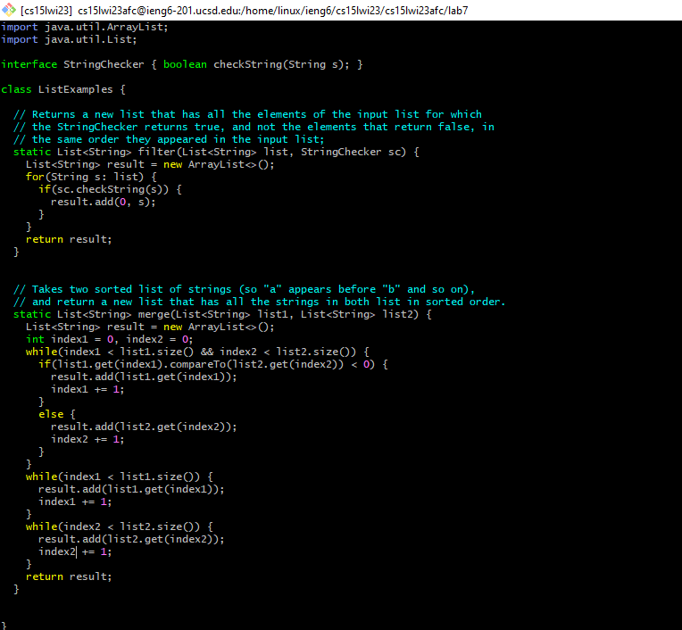

Step 4
=
```ssh cs15lwi23afc@ieng6.ucsd.edu``` \
```<enter>```

Logs into ieng6.\


Step 5
=
```git clone <shift+insert>```\
```<enter>```

Clones the git repo with the clipboard containing the ssh clone url.\


Step 6
=
```cd l <tab>```\
```<enter>```\
```<shift+insert>```\
```<enter>```\
```<shift+insert> <space> L <tab> T <tab> <backspace>```\
```<enter>```

First cd into the repo. Then, the first time using ```<shift+insert>``` to 
paste contains the command to compile the tester and java files. The second 
time paste is used it contains the command to run the tester and key presses 
after that autocomplete and ```<backspace>``` to remove the ```.``` to get
```ListExamplesTest```.


Step 7
=
```vi L <tab> . < tab>```\
```<right> i <backspace> 2 <esc>```\
```:x```

Use vi and autocomplete with tab to open the ```ListExamples.java``` file to 
edit. Vi seems to remember where your last position of editing is, so it put 
the cursor to the left of the 1 in ```index1```. Using ```<right>``` to get 
behind the 1 and ```i``` to go into editing just replace the 1 with a 2. 
Lastly, ```<esc>``` exits editing and ```:x``` to save and exit.



Step 8
=
```<shift+insert>```\
```<enter>```\
```<shift+insert> <space> L <tab> T <tab> <backspace>```\
```<enter>```

A repeat of step 6.


Step 9
=
```git add L <tab> j <tab```\
```<enter>```\
```git commit -m "fix infinite loop"```\
```<enter>```\
```git push```\
```<enter>```

Git add ```ListExample.java```. Git commit with message: "fox infinite loop".
Finally, git push.

